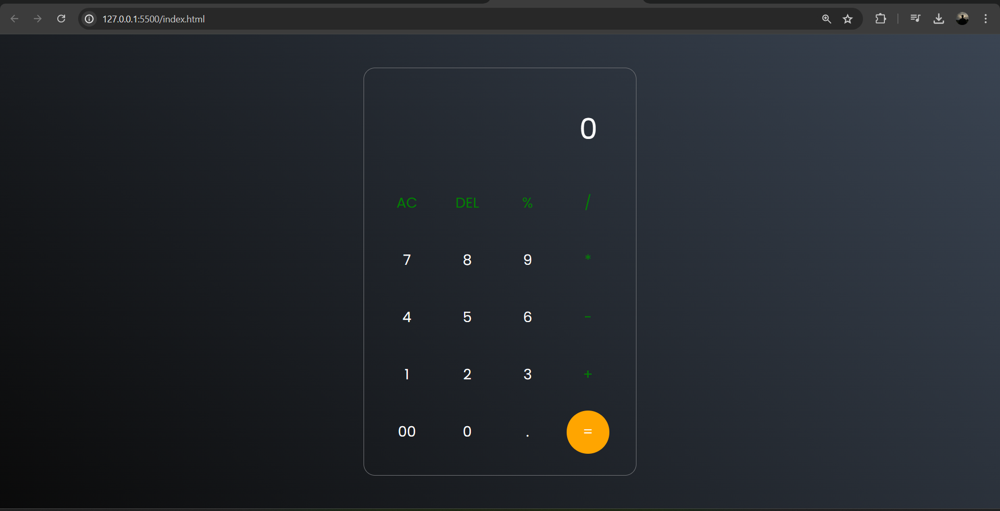

# 👉CALCULATOR
In this project I have created a simple calculator using HTML, CSS and JAVASCRIPT. This Calculator performs simple mathematical calculations like ADDITION(+), SUBTRACTION(-), MULTIPLICATION(*), DIVISION(/) etc.
## 👉Why Use It
Its useful for simple calculations.
## ScreenShot

